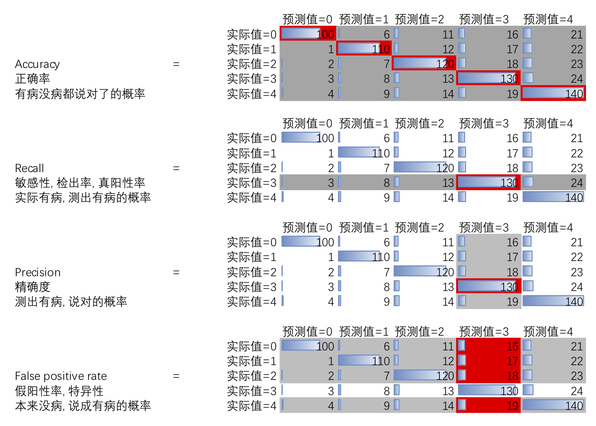

<!--
.. title: Scikit-learn笔记3(各种率)
.. slug: scikit-learn-note-3
.. date: 2018-4-1 12:00 UTC+08:00
.. tags: python
.. category:
.. link:
.. description:
.. type: text
-->

关于precision, recall的定义, 关于假阳性, 假阴性, 真阳性, 真阴性之类的定义, 我以后一定还是会忘记的.

而且鉴于我以前凡是两个能够弄混的事情一定可以弄混的特性,

于是把什么真假阴性阳性扩展到更多的情况, 画了张图

红色是分子, 灰色是分母. (灰色区域都是包含红色的)

